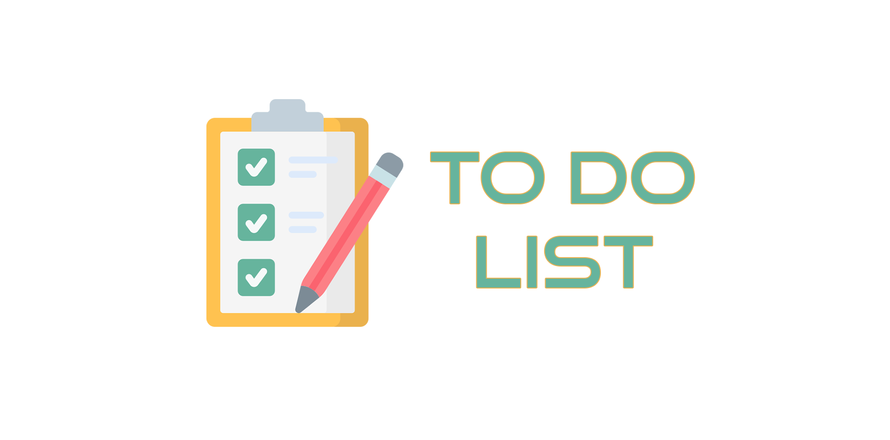
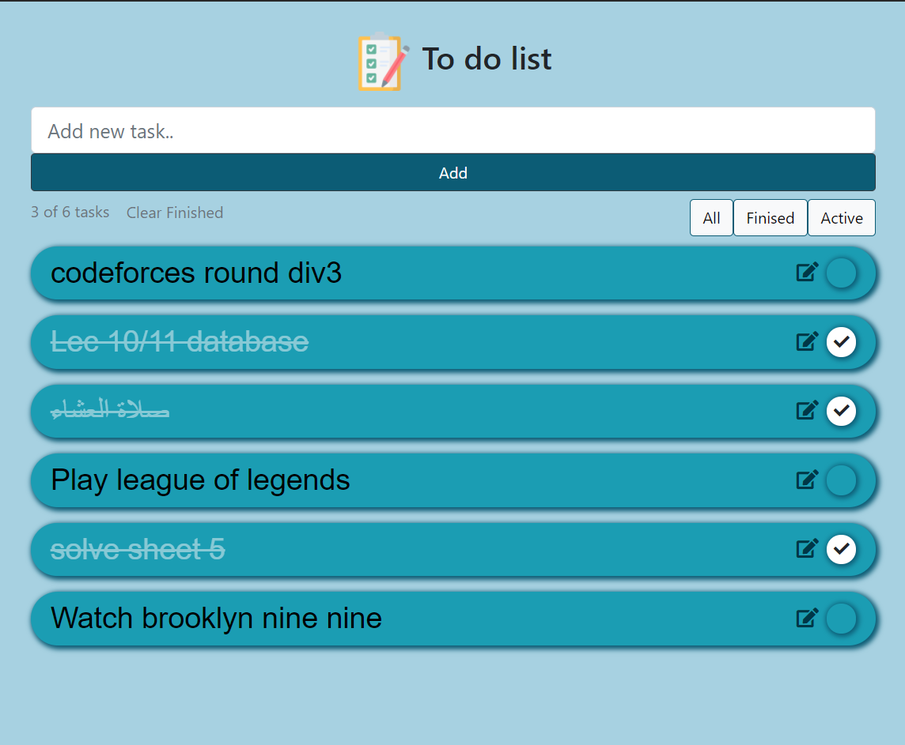

# Todo List using react
<p align="center">
  <a href="" rel="noopener">
 </a>
</p>
<p align="center"> To do list
    <br> 
</p>
<div align="center">
  
[](https://github.com/todolist-react/contributors)
[](https://github.com/ahmednassar7/todolist-react/issues)
[](https://github.com/ahmednassar7/todolist-react/network)
[](https://github.com/ahmednassar7/todolist-react/stargazers)

</div>

## 🏁 Get Started <a name = "Install"></a>

```
git clone https://github.com/ahmednassar/todolist_react.git
```
```
npm install
```
```
npm run start
```
## 💻 Built Using <a name = "tech"></a>
- **React**
## 📷 Screenshots


